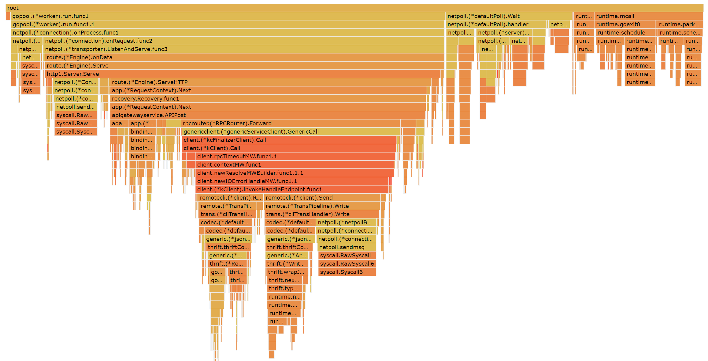
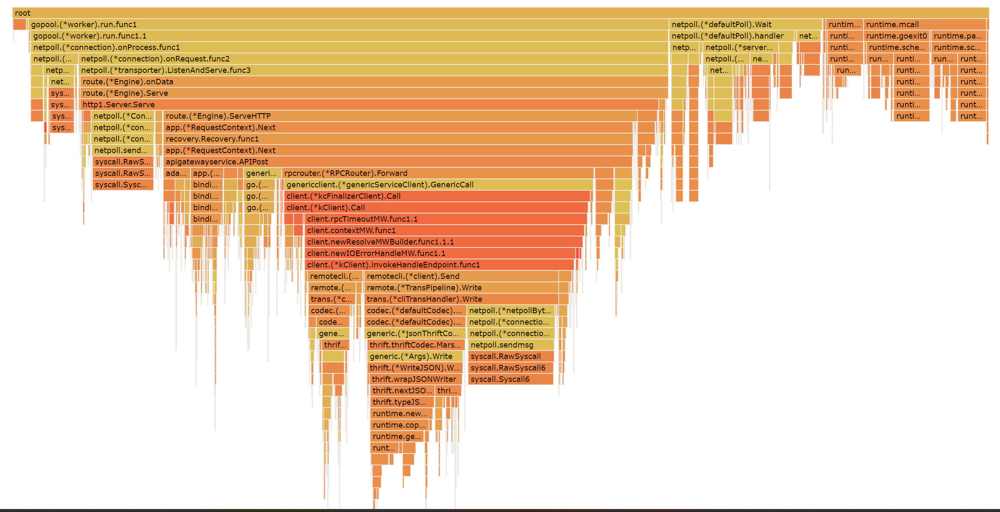

# APIGateway-based-on-CloudWeGo性能测试和优化报告
## 小组成员
- [x] 陈皓鑫🌶️ [@crotchets](https://github.com/211250236)
- [x] 张哲恺🌴 [@Corax](https://github.com/KYCoraxxx)
- [x] 张铭铭🍵 [@TTHA](https://github.com/T-THA)
## 测试方案说明
> TODO: 是否需要提出更量化的指标

本小组实现的API网关一共实现了两个功能，如下所示：

- 通过HTTP实现IDL的多版本控制与管理
- 接收HTTP请求并转发给RPC服务器完成对学生信息管理的处理

### IDL多版本控制与管理

IDL多版本控制与管理由HTTP服务器自行管理，不需要转发请求，因此主要进行对该模块增、删、查的功能及面对高并发压力的能力进行测试

### API网关学生信息管理

RPC服务端一共实现了两种数据管理方式，分别是暂存于运行内存和存储于公网服务器postgresql数据库。对于两者而言，仍然主要对其增、查及面对高并发压力的能力进行测试，其中对于存储于公网服务器数据库的RPC服务器，还要额外考虑在性能资源有限的情况下如何面对高压力访问

## 性能测试数据

### IDL多版本控制于管理

#### 高压力连续查询
```bash
ab -n 1000 -c 10 -H 'IDLVersion: 1.0' -T 'application/json' -p data.json http://127.0.0.1:8888/agw/student/Query
```

### API网关学生信息管理

#### 较高压力连续查询
```bash
ab -n 1000 -c 10 -H 'IDLVersion: 1.0' -T 'application/json' -p data.json http://127.0.0.1:8888/agw/student/Query
```
查询中使用的`data.json`文件如下所示
```json
{
  "id" : 1
}
```
测试结果如下：
1. 返回结果
```text
This is ApacheBench, Version 2.3 <$Revision: 1879490 $>
Copyright 1996 Adam Twiss, Zeus Technology Ltd, http://www.zeustech.net/
Licensed to The Apache Software Foundation, http://www.apache.org/

Benchmarking 127.0.0.1 (be patient)
Completed 100 requests
Completed 200 requests
Completed 300 requests
Completed 400 requests
Completed 500 requests
Completed 600 requests
Completed 700 requests
Completed 800 requests
Completed 900 requests
Completed 1000 requests
Finished 1000 requests


Server Software:        hertz
Server Hostname:        127.0.0.1
Server Port:            8888

Document Path:          /agw/student/Query
Document Length:        0 bytes

Concurrency Level:      10
Time taken for tests:   0.413 seconds
Complete requests:      1000
Failed requests:        0
Total transferred:      109000 bytes
Total body sent:        187000
HTML transferred:       0 bytes
Requests per second:    2423.98 [#/sec] (mean)
Time per request:       4.125 [ms] (mean)
Time per request:       0.413 [ms] (mean, across all concurrent requests)
Transfer rate:          258.02 [Kbytes/sec] received
                        442.66 kb/s sent
                        700.68 kb/s total

Connection Times (ms)
              min  mean[+/-sd] median   max
Connect:        0    0   0.1      0       0
Processing:     0    3   4.2      2     126
Waiting:        0    3   4.2      2     126
Total:          0    3   4.2      3     126

Percentage of the requests served within a certain time (ms)
  50%      3
  66%      3
  75%      4
  80%      4
  90%      5
  95%      6
  98%      7
  99%     10
 100%    126 (longest request)
```
2. RPC端情况
```text
2023/07/26 11:34:22 dial tcp 110.42.252.167:5432: connect: connection refused
exit status 1
```
在面对较高压力的情况下，性能一般的公网服务器数据库进程被打挂了❌

#### 高压力连续查询

将测试命令更改为
```bash
ab -n 100000 -c 10 -H 'IDLVersion: 1.0' -T 'application/json' -p data.json http://127.0.0.1:8888/agw/student/Query
```
1. 返回数据
```text
This is ApacheBench, Version 2.3 <$Revision: 1879490 $>
Copyright 1996 Adam Twiss, Zeus Technology Ltd, http://www.zeustech.net/
Licensed to The Apache Software Foundation, http://www.apache.org/

Benchmarking 127.0.0.1 (be patient)
Completed 10000 requests
Completed 20000 requests
Completed 30000 requests
Completed 40000 requests
Completed 50000 requests
Completed 60000 requests
Completed 70000 requests
Completed 80000 requests
Completed 90000 requests
Completed 100000 requests
Finished 100000 requests


Server Software:        hertz
Server Hostname:        127.0.0.1
Server Port:            8888

Document Path:          /agw/student/Query
Document Length:        169 bytes

Concurrency Level:      10
Time taken for tests:   5.994 seconds
Complete requests:      100000
Failed requests:        0
Total transferred:      32700000 bytes
Total body sent:        18700000
HTML transferred:       16900000 bytes
Requests per second:    16684.15 [#/sec] (mean)
Time per request:       0.599 [ms] (mean)
Time per request:       0.060 [ms] (mean, across all concurrent requests)
Transfer rate:          5327.85 [Kbytes/sec] received
                        3046.81 kb/s sent
                        8374.66 kb/s total

Connection Times (ms)
              min  mean[+/-sd] median   max
Connect:        0    0   0.1      0       1
Processing:     0    1   0.2      0       6
Waiting:        0    0   0.2      0       6
Total:          0    1   0.2      1       6
ERROR: The median and mean for the processing time are more than twice the standard
       deviation apart. These results are NOT reliable.

Percentage of the requests served within a certain time (ms)
  50%      1
  66%      1
  75%      1
  80%      1
  90%      1
  95%      1
  98%      1
  99%      1
 100%      6 (longest request)
```
2. pprof监测结果



#### 高压力连续注册

测试命令为:
```bash
ab -n 100000 -c 10 -H 'IDLVersion: 1.0' -T 'application/json' -p data.json http://127.0.0.1:8888/agw/student/Register
```
使用的`data.json`文件如下所示:
```json
{
    "id": 4,
    "name" : "KFC",
    "college" : {"name": "KFC", "address": "Thursday"},
    "email" : ["2631197015@qq.com", "211250245@smail.nju.edu.cn"],
    "sex" : "female"
}
```

1. 返回数据
```text
This is ApacheBench, Version 2.3 <$Revision: 1879490 $>
Copyright 1996 Adam Twiss, Zeus Technology Ltd, http://www.zeustech.net/
Licensed to The Apache Software Foundation, http://www.apache.org/

Benchmarking 127.0.0.1 (be patient)
Completed 10000 requests
Completed 20000 requests
Completed 30000 requests
Completed 40000 requests
Completed 50000 requests
Completed 60000 requests
Completed 70000 requests
Completed 80000 requests
Completed 90000 requests
Completed 100000 requests
Finished 100000 requests


Server Software:        hertz
Server Hostname:        127.0.0.1
Server Port:            8888

Document Path:          /agw/student/Register
Document Length:        53 bytes

Concurrency Level:      10
Time taken for tests:   5.934 seconds
Complete requests:      100000
Failed requests:        99999
   (Connect: 0, Receive: 0, Length: 99999, Exceptions: 0)
Total transferred:      24599964 bytes
Total body sent:        35900000
HTML transferred:       8899964 bytes
Requests per second:    16851.88 [#/sec] (mean)
Time per request:       0.593 [ms] (mean)
Time per request:       0.059 [ms] (mean, across all concurrent requests)
Transfer rate:          4048.39 [Kbytes/sec] received
                        5908.03 kb/s sent
                        9956.43 kb/s total

Connection Times (ms)
              min  mean[+/-sd] median   max
Connect:        0    0   0.1      0       1
Processing:     0    0   3.8      0    1016
Waiting:        0    0   3.8      0    1016
Total:          0    0   3.8      0    1016

Percentage of the requests served within a certain time (ms)
  50%      0
  66%      0
  75%      1
  80%      1
  90%      1
  95%      1
  98%      1
  99%      1
 100%   1016 (longest request)
```
2. pprof监测结果



## 性能优化方案

### IDL多版本管理与控制

### API网关学生信息管理

#### 较高压力连续查询

为RPC服务端添加数据查询缓存，查询一次之后就将查询的数据存入缓存，之后的相同查询就直接从缓存中取数据，不再访问数据库
```go
func (s *StudentServiceImpl) Query(ctx context.Context, req *demo.QueryReq) (resp *demo.Student, err error) {
	resp = demo.NewStudent()
	var oldStudent demo.Student
	if value, exist := studentMap[req.Id]; exist {
		fmt.Println("Use Cache")
		resp = value
		return
	} else {
		fmt.Println("Query Database")
		err = QueryFromDatabase(req.Id, &oldStudent)
		if err != nil {
			return
		}
		if oldStudent.Id == -1 {
			var student = demo.Student{
				Id:      -1,
				Name:    "Student Not Exist",
				College: &demo.College{Name: "Unknown", Address: "Unknown"},
				Email:   nil,
			}
			resp = &student
		} else {
			resp = &oldStudent
			studentMap[req.Id] = &oldStudent
		}
		return
	}
}
```
同样也为注册方法添加缓存
```go
func (s *StudentServiceImpl) Register(ctx context.Context, student *demo.Student) (resp *demo.RegisterResp, err error) {
	resp = demo.NewRegisterResp()
	var newStudent demo.Student
	if _, exist := studentMap[student.Id]; exist {
		resp.Success = false
		resp.Message = "Register Failed: Student Information Already Exists"
	} else {
		err = QueryFromDatabase(student.Id, &newStudent)
		if err != nil {
			resp.Success = false
			resp.Message = "Internal Exception"
		}
		if newStudent.Id > 0 {
			studentMap[student.Id] = &newStudent
			resp.Success = false
			resp.Message = "Register Failed: Student Information Already Exists"
		} else {
			err = InsertIntoDatabase(student)
			if err != nil {
				resp.Success = false
				resp.Message = "Internal Exception"
			}
			resp.Success = true
			resp.Message = "Register Success"
		}
		fmt.Println(resp)
	}
	return
}
```

#### 高压力连续查询

根据性能测试数据来看，在经过数据缓存优化之后，系统的性能已经基本满足期望要求

#### 高压力连续注册

根据性能测试数据来看，在经过数据缓存优化之后，系统的性能已经基本满足期望要求

## 优化后性能数据

### IDL多版本管理与控制

### API网关学生信息管理

#### 较高压力连续查询

1. 返回数据
```text
This is ApacheBench, Version 2.3 <$Revision: 1879490 $>
Copyright 1996 Adam Twiss, Zeus Technology Ltd, http://www.zeustech.net/
Licensed to The Apache Software Foundation, http://www.apache.org/

Benchmarking 127.0.0.1 (be patient)
Completed 100 requests
Completed 200 requests
Completed 300 requests
Completed 400 requests
Completed 500 requests
Completed 600 requests
Completed 700 requests
Completed 800 requests
Completed 900 requests
Completed 1000 requests
Finished 1000 requests


Server Software:        hertz
Server Hostname:        127.0.0.1
Server Port:            8888

Document Path:          /agw/student/Query
Document Length:        169 bytes

Concurrency Level:      10
Time taken for tests:   0.303 seconds
Complete requests:      1000
Failed requests:        0
Total transferred:      327000 bytes
Total body sent:        187000
HTML transferred:       169000 bytes
Requests per second:    3299.42 [#/sec] (mean)
Time per request:       3.031 [ms] (mean)
Time per request:       0.303 [ms] (mean, across all concurrent requests)
Transfer rate:          1053.62 [Kbytes/sec] received
                        602.53 kb/s sent
                        1656.15 kb/s total

Connection Times (ms)
              min  mean[+/-sd] median   max
Connect:        0    0   0.1      0       1
Processing:     0    1   7.9      0     250
Waiting:        0    1   7.9      0     250
Total:          0    1   7.9      0     250

Percentage of the requests served within a certain time (ms)
  50%      0
  66%      1
  75%      1
  80%      1
  90%      1
  95%      1
  98%      1
  99%      2
 100%    250 (longest request)
```
2. RPC端情况
```text
Query Database
Use Cache
Use Cache
......
```
可见性能得到明显提升，而且公网服务器存活了下来😊